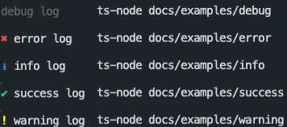

# :keyboard: log

Simple logging utility

[](https://conventionalcommits.org)
[](https://www.typescriptlang.org/)
[](https://github.com/facebook/jest)

## Overview

[Getting Started](#getting-started)  
[Usage](#usage)  
[Built With](#built-with)  
[Contributing](CONTRIBUTING.md)

## Getting Started

Style logs for the console or [terminal][3].

## Installation

```zsh
yarn add @flex-development/log # or npm i @flex-development/log
```

## Usage

Customize log entries and create entries based on log `Level` presets.

### Levels

Create a log entry using a `Level` preset.



#### Debug

Create a log entry in gray.

```typescript
import log from '@flex-development/log'

/**
 * @file Examples - debug log
 * @module log/docs/examples/debug
 */

log('debug log')
```

#### Error

Create a log entry with a red cross.

```typescript
import log, { LogLevel } from '@flex-development/log'

/**
 * @file Examples - error log
 * @module log/docs/examples/error
 */

log('error log', { level: LogLevel.ERROR })
```

#### Info

Create a log entry with a blue info symbol.

```typescript
import log, { LogLevel } from '@flex-development/log'

/**
 * @file Examples - info log
 * @module log/docs/examples/info
 */

log('info log', { level: LogLevel.INFO })
```

#### Success

Create a log entry with a green tick mark.

```typescript
import log, { LogLevel } from '@flex-development/log'

/**
 * @file Examples - success log
 * @module log/docs/examples/success
 */

log('success log', { level: LogLevel.SUCCESS })
```

#### Warning

Create a log entry with a yellow exclamation point.

```typescript
import log, { LogLevel } from '@flex-development/log'

/**
 * @file Examples - warning log
 * @module log/docs/examples/warning
 */

log('warning log', { level: LogLevel.WARN })
```

### Options

```typescript
interface LogOptions {
  /**
   * Log arguments.
   *
   * @default []
   */
  args?: any[]

  /**
   * Bold log arguments **and/or** log data.
   *
   * @default {args:true}
   */
  bold?: LogOptionsBold

  /**
   * Set log color, and/or override the log figure color set by `level`.
   *
   * @default {args:'white',data:'white'}
   */
  color?: LogOptionsColor

  /**
   * Override the log figure set by `level`, or omit it altogether.
   */
  figure?: keyof typeof figures | NullishString

  /**
   * Log level.
   *
   * @default 'DEBUG'
   */
  level?: Level

  /**
   * Use [`echo`][1] instead of `console.log`. Requires [`shelljs`][2].
   *
   * [1]: https://github.com/shelljs/shelljs#echooptions-string--string-
   * [2]: https://github.com/shelljs/shelljs
   */
  shell?: boolean

  /**
   * If `true`, do not log any output.
   */
  silent?: boolean
}

enum LogLevel {
  DEBUG = 'debug',
  ERROR = 'error',
  INFO = 'info',
  SUCCESS = 'success',
  WARN = 'warn'
}

export type Level = keyof typeof LogLevel | LogLevel
```

## Built With

- [`chalk`][1] - Terminal string styling
- [`shelljs`][2] - Unix shell commands implementation for Node.js

[1]: https://github.com/chalk/chalk
[2]: https://github.com/shelljs/shelljs
[3]: https://github.com/shelljs/shelljs#echooptions-string--string-
